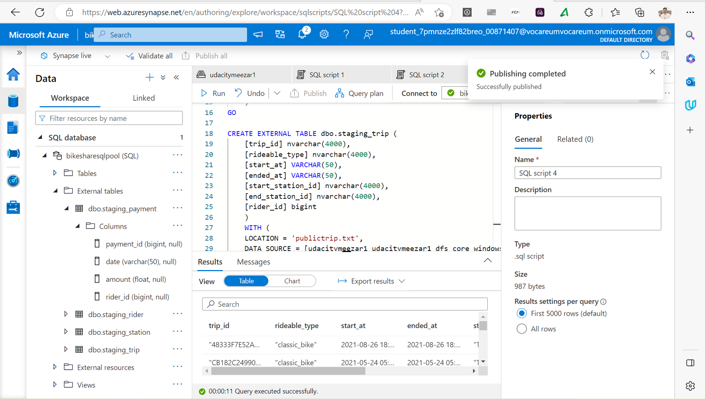

# Azure-Data-Warehouse-for-Bike-Share-Data-Analytics
### Divvy is a bike sharing program in Chicago, Illinois USA that allows riders to purchase a pass at a kiosk or use a mobile application to unlock a bike at stations around the city and use the bike for a specified amount of time. The bikes can be returned to the same station or to another station. The City of Chicago makes the anonymized bike trip data publicly available for projects like this where we can analyze the data. The dataset looks like this

The goal of this project is to develop a data warehouse solution using Azure Synapse Analytics. You will:
•	Design a star schema based on the business outcomes listed below;
•	Import the data into Synapse;
•	Transform the data into the star schema;
•	and finally, view the reports from Analytics.
The business outcomes you are designing for are as follows:
1.	Analyze how much time is spent per ride
•	Based on date and time factors such as day of week and time of day
•	Based on which station is the starting and / or ending station
•	Based on age of the rider at time of the ride
•	Based on whether the rider is a member or a casual rider
2.	Analyze how much money is spent
•	Per month, quarter, year
•	Per member, based on the age of the rider at account start
3.	EXTRA CREDIT - Analyze how much money is spent per member
•	Based on how many rides the rider averages per month
•	Based on how many minutes the rider spends on a bike per month
## First Step Create Azure resources
•	Create an Azure PostgreSQL database
•	Create an Azure Synapse workspace. 
### 1- Create an Azure PostgreSQL database

### 2- Create Azure resources
#### 2-1-Create an Azure Synapse workspace

#### 2-2 Create a Dedicated SQL Pool and database within the Synapse workspace

## Second Step Design a star schema
Based on the given set of business requirements the following star schema was designed

## Third Step Create the data in PostgreSQL
### 1-Open  the script file ProjectDataToPostgres.py  in VS Code and add the host, username, and password information for your PostgreSQL database

### 2-Run the script and verify that all four data files are copied/uploaded into PostgreSQL we can veiw the table in local machine PGAdmin 4

## Fourth Step EXTRACT the data from PostgreSQL

In our Azure Synapse workspace, we will use the ingest wizard to create a one-time pipeline that ingests the data from PostgreSQL into Azure Blob Storage. This will result in all four tables being represented as text files in Blob Storage, ready for loading into the data warehouse

### 1-First create link connection to my Postgres database udacityproject
And as shown in the screenshot the connection succeeded

### 2- create link connection to Azure Blop Storage
And as shown in the screenshot the connection succeeded

### 3-In our Azure Synapse workspace, we will use the ingest wizard to create a one-time pipeline that ingests the data from PostgreSQL into Azure Blob Storage. This will result in all four tables being represented as text files in Blob Storage, ready for loading into the data warehouse

## Fifth Step LOAD the data into external tables in the data warehouse
Once in Blob storage, the files will be shown in the data lake node in the Synapse Workspace. 

### 1-create external table staging_payment run SQL script file Payment_load.sql 

### 2-create external table staging_rider run SQL script file rider_load.sql 

### 3-create external table staging_station run SQL script file station_load.sql

### 4-create external table staging_trip run SQL script file trip_load.sql 

### Now we notice that the 4 tables are created in EXTERNAL TABLE 

## Sixth Step TRANSFORM the data to the star schema
### 1- in synapse workspace we go to Develop and we create new SQL script .

### 2- For the fife tables star schema I had explain in the Second step
So for each table of the following we run SQL script the script in transfor_files
1- time_dim
2- rider_dim
3- payment_fact
4- station_dim
5- trip_fact
So we can notice the 5 tables are created in bikesharesqlpool DB workspace

